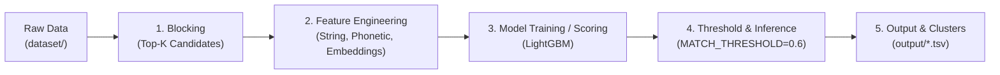

# Business Entity Resolution ML Pipeline

A modular, production-oriented Machine Learning pipeline for **Business Entity Resolution** (also known as Record Linkage, Entity Matching, or Company Deduplication).

---

## 1. Project Purpose

In enterprise data platforms, business entity records frequently arrive from heterogeneous sources (CRM, ERP, vendor registries, public filings, web scrapes). These records often exhibit:
- **Lexical variations and typos**: e.g., `"Walmart Inc."` vs. `"Wal-Mart Stores, LLC"` vs. `"Wal Mart"`.
- **Legal entity suffix discrepancies**: e.g., `Inc`, `Corp`, `LLC`, `GmbH`, `Ltd`.
- **Incomplete or missing attributes**: e.g., missing phone numbers, truncated addresses, or alternative trade names (DBAs).
- **Scale challenges**: Comparing $N$ entities naively requires $\mathcal{O}(N^2)$ comparisons. For 100,000 records, that entails ~5 billion comparisons.

This pipeline provides a scalable, two-stage entity resolution framework:
1. **Blocking (Candidate Generation)**: Quickly filters potential matches down to the top-$K$ candidates per entity using inverted indexing, character $n$-gram TF-IDF, or vector search, avoiding quadratic explosion.
2. **Pairwise Feature Engineering & Classification**: Computes multi-attribute similarity vectors (fuzzy string distances, phonetic encodings, semantic embeddings) and classifies pairs using a gradient-boosted decision tree (`LightGBM`) with calibrated confidence thresholds.

---

## 2. Directory Structure

```
business_entity_resolution/
│
├── dataset/
│   ├── train/                  # Raw and preprocessed training datasets
│   │   └── .gitkeep
│   └── test/                   # Evaluation and inference benchmark datasets
│       └── .gitkeep
│
├── notebooks/                  # Jupyter notebooks for EDA and error analysis
│   └── .gitkeep
│
├── output/                     # Generated candidate pairs, predictions, and reports
│   └── .gitkeep                # (TSV/CSV artifacts ignored via .gitignore)
│
├── src/                        # Core pipeline source code
│   ├── __init__.py
│   ├── config.py               # Central configuration, hyperparameters & paths
│   │
│   ├── blocking/               # Stage 1: Candidate pair generation
│   │   └── __init__.py
│   │
│   ├── features/               # Stage 2: Pairwise similarity feature extraction
│   │   └── __init__.py
│   │
│   ├── models/                 # Stage 3: Classifiers, matchers & evaluation
│   │   └── __init__.py
│   │
│   └── utils/                  # Shared text cleaning, I/O & normalization helpers
│       └── __init__.py
│
├── tests/                      # Unit and integration test suite
│   ├── __init__.py
│   └── .gitkeep
│
├── .gitignore                  # Git ignore rules
├── README.md                   # Project documentation & execution guide
└── requirements.txt            # Pinned dependencies (MIT / Apache / Permissive)
```

### Folder Roles

| Directory | Purpose |
| :--- | :--- |
| `src/` | Root package for pipeline components. |
| `src/blocking/` | Implements indexing and blocking algorithms (e.g., TF-IDF $n$-grams, MinHash/LSH, embedding nearest neighbors) to reduce the comparison space to top-$K$ candidates. |
| `src/features/` | Extracts similarity features (Levenshtein, Jaro-Winkler, phonetic matching, token sort ratio, dense embedding cosine similarities). |
| `src/models/` | Houses the LightGBM classifier, decision thresholding, clustering (connected components), and performance metrics (Precision, Recall, F1, PR-AUC). |
| `src/utils/` | Reusable utilities including company name normalization (stripping legal suffixes, punctuation, case folding) and parquet/tabular I/O. |
| `dataset/train/` | Ground-truth pairs and training partitions. |
| `dataset/test/` | Holdout evaluation sets and unlabelled test entities for inference. |
| `output/` | Serialized model predictions, candidate pair caches, and benchmark results. |
| `notebooks/` | Interactive exploration, threshold tuning, and false positive/negative analysis. |
| `tests/` | Automated unit tests covering text normalization, feature computation, and model scoring. |

---

## 3. Environment Setup

### Prerequisites
- Python 3.10, 3.11, or 3.12
- Git

### Virtual Environment Setup

1. **Clone or navigate to the repository:**
   ```bash
   cd business_entity_resolution
   ```

2. **Create a virtual environment:**
   - **Windows / macOS / Linux:**
     ```bash
     python -m venv .venv
     ```

3. **Activate the virtual environment:**
   - **Windows (PowerShell):**
     ```powershell
     .venv\Scripts\Activate.ps1
     ```
     *(If script execution is disabled on PowerShell, run `Set-ExecutionPolicy -ExecutionPolicy RemoteSigned -Scope CurrentUser`)*
   - **Windows (Command Prompt):**
     ```cmd
     .venv\Scripts\activate.bat
     ```
   - **macOS / Linux (bash/zsh):**
     ```bash
     source .venv/bin/activate
     ```

4. **Upgrade pip and install pinned dependencies:**
   ```bash
   python -m pip install --upgrade pip
   pip install -r requirements.txt
   ```

5. **Verify installation:**
   ```bash
   python -c "import pandas, sklearn, lightgbm, rapidfuzz, sentence_transformers; print('Environment initialized successfully!')"
   ```

---

## 4. End-to-End Pipeline Execution

The pipeline executes in sequential stages:



### Pipeline Stages

1. **Data Ingestion & Normalization (`data`)**
   - Ingests raw tabular data (CSV/Parquet/TSV) from `dataset/train/` and `dataset/test/`.
   - Cleans and standardizes company attributes (lowercase, legal suffix canonicalization via `src/utils/`, whitespace normalization).

2. **Candidate Blocking (`blocking`)**
   - Applies fast indexing (e.g., character $n$-gram TF-IDF or vector indexing).
   - Generates candidate pairs capped at `BLOCKING_TOP_K` (default: 15) candidates per query entity, pruning 99%+ of non-matches.

3. **Feature Engineering (`features`)**
   - Computes multi-attribute similarity vectors for candidate pairs:
     - **Edit & String Metrics**: Levenshtein distance, Jaro-Winkler, token sort ratio (`rapidfuzz`).
     - **Phonetic Encoding**: Double Metaphone, Soundex, Match Rating Approach (`jellyfish`).
     - **Semantic Representations**: Cosine similarity of dense embeddings (`sentence-transformers`).
     - **Exact Attribute Matching**: City, postal code, domain matching.

4. **Model Training & Scoring (`model`)**
   - Trains a `LightGBM` binary classifier on labeled pairs with `RANDOM_SEED=42`.
   - Uses class-weight calibration to handle class imbalance between matches and non-matches.
   - Evaluates performance using Precision, Recall, and F1 at varying cutoffs.

5. **Inference & Decision Thresholding (`inference`)**
   - Scores candidate pairs on unseen test sets (`dataset/test/`).
   - Filters pairs matching `probability >= MATCH_THRESHOLD` (default: 0.6).
   - Resolves transitive entity clusters (e.g., A matches B and B matches C $\implies$ A, B, C belong to the same entity cluster).

6. **Output Generation (`output`)**
   - Exports resolved candidate pairs and cluster assignments into `output/` (e.g. `output/resolved_entities.tsv`).

---

## 5. Configuration

Core hyperparameters and directory paths are centrally defined in `src/config.py`:

```python
BLOCKING_TOP_K = 15          # Maximum candidate pairs retrieved per query entity
MATCH_THRESHOLD = 0.6        # Probability threshold to classify a pair as a match
RANDOM_SEED = 42             # Seed for reproducible train/test splits and models
TRAIN_DIR = "dataset/train"  # Training dataset path
TEST_DIR = "dataset/test"    # Test dataset path
OUTPUT_DIR = "output"        # Directory for output predictions and artifacts
```

---

## 6. Running Tests

To run the unit test suite once test cases are added:
```bash
pytest tests/ -v
```
